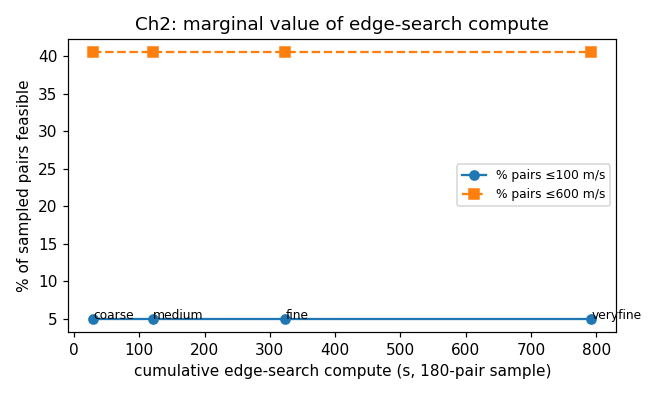

# E-019 — Edge-search compute past coarse has ZERO marginal value

## Result

Four resolution rungs on a fixed 180-pair sample, cumulative
~13 minutes parallel-compute:

| res | wall (s) | frac ≤100 | frac ≤600 | median Δv | min Δv |
|---|---|---|---|---|---|
| coarse | 29 | **0.050** | **0.406** | 671.0 | 32.2 |
| medium | 92 | 0.050 | 0.406 | 668.6 | 31.2 |
| fine | 202 | 0.050 | 0.406 | 668.2 | 31.2 |
| veryfine | 469 | 0.050 | 0.406 | 668.2 | 31.2 |

## Verdict + analysis

**verdict: refutes** the E-017 "under-resolved cheap-edge graph"
hypothesis *quantitatively*. 16× more compute at "veryfine" added
**zero** cheap edges at either ≤100 or ≤600. Median Δv shifted by
< 0.5 %. The cheap-edge graph is structurally saturated at coarse
resolution.

**Decision impact for "where to spend heavy compute":**
- **NOT on edge-search resolution** — flat marginal value.
- The hi-accuracy `edges_small.npz` *is* essentially the complete
  cheap-edge graph (138 ≤100 + 837 in (100,600]).
- The unsolved bottleneck (E-018) is **time-coupling**: each cheap
  edge has narrow windows in absolute time; chronological chaining
  is the binding constraint.
- Right heavy-compute target → (a) **multi-window-per-edge
  extraction** (cheap-window list as a function of t_dep, not a
  single min — feeds (b)); (b) **time-windowed CP-SAT solver** with
  chronology constraints; (c) **medium/large** scale-up of the same
  pipeline (heavy precompute reused, structure preserved per Q6).
