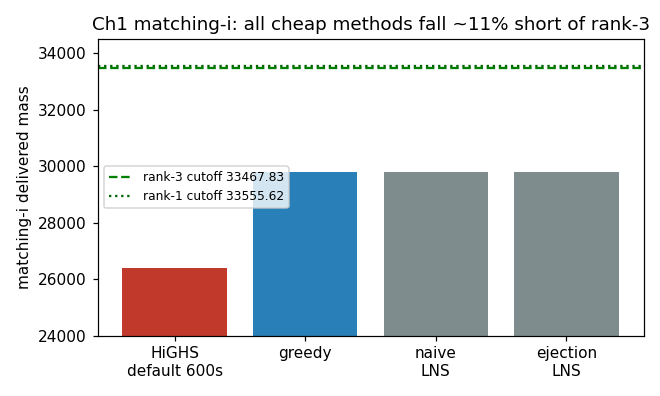

# T-001 — Ch1 matching rank-3 needs strong parallel search

## Summary

Default HiGHS MIP, weight-greedy, and greedy-seeded LNS/ejection all
plateau **~11–13 % below the Ch1 rank-3 cutoff** (`matching-i`
greedy 29792 vs 33468 = 89 %; `matching-ii` 63313 vs 72101 = 88 %;
HiGHS-default worse at 79 %). Greedy is a *provable* hard local
optimum for the natural neighbourhoods (see
[[lessons/L-001-greedy-localopt-and-suppressed-solver-log|L-001]]),
and the weak 3-D-matching LP relaxation starves default B&B. The
top field clusters tightly at +12.5 % over greedy → competitors use
materially stronger methods.

## Evidence

- [[hypotheses/H-001-ch1-matching-mip|H-001]] — prediction refuted.
- [[experiments/E-001-ch1-matching-first-attempts|E-001]] — data.
- [[observations/O-002-leaderboard-2026-05-18|O-002]] — cutoffs.

## Implications

1. **Recalibrate expectations down, campaign-wide.** Confirmed by
   the user from past SpOC experience: challenges are hard with many
   local minima; cheap/exact-default methods do not trivially clear
   rank-3. Falsifiable predictions and `expected_points` must be
   pessimistic; first results are baselines, not wins.
2. **Parallelism is mandatory infrastructure**, not an optimisation.
   Next methods must be multi-core/multi-start by construction
   (parallel restarts, pygmo archipelago, parallel sub-MIP LNS).
3. Viable rank-3 routes for Ch1 matching: **MIP-based LNS**
   (destroy a region, exact HiGHS sub-solve), **parallel
   worse-accepting metaheuristic** with long ejection chains, or a
   **strong exact solver** with long tuned runs (± Gurobi if
   licensed). Greedy/ejection are warm starts only.

## Position vs goal

- **Contribution:** 0 points banked. Valid feasible baselines exist
  (`solutions/upload/matching-i.json`, `matching-ii.json`, greedy) —
  insurance per META.md §2, not scoring.
- **Where we stand:** ~11 % short of Ch1 easy rank-3 on the
  highest-ROI instances; nothing yet on Ch2/trajectory.
- **Next move:** strategic fork to the user (parallel MIP-LNS vs
  parallel metaheuristic vs long exact). H-001 closed refuted;
  children priced conservatively on the frontier.

## Caveats

`matching-ii` MIP not run (greedy only). HiGHS not yet tried
warm-started/tuned/long — that is a child hypothesis, not a closed
negative. The refutation is of "cheap methods clear rank-3", not of
"a strong exact solver could".
