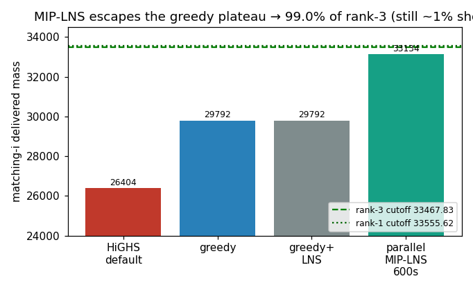

# T-002 — MIP-LNS family validated; independent parallel plateaus ~1% short

## Summary

Destroy-and-exactly-repair (MIP-LNS) is the correct method family
for Ch1 matching: it escapes the provable greedy local optimum that
sank H-001, lifting `matching-i` from greedy 29 792 (89 %) to
**33 134 (99.0 % of rank-3)**. But independent parallel workers
plateau ~1 % below the rank-3 cutoff (tight per-worker spread
33 002–33 134) — diminishing returns from a fixed destroy size and
no information sharing. The remaining ~334 mass is a *qualitatively
different* search problem (escaping a near-optimal basin), not a
"run longer" problem.

## Evidence

- [[hypotheses/H-004-ch1-matching-mip-lns|H-004]] — prediction refuted.
- [[experiments/E-002-ch1-matching-i-mip-lns-campaign|E-002]] — data.
- [[observations/O-002-leaderboard-2026-05-18|O-002]] — cutoffs.

## Implications

1. **Keep the family, change the search dynamics.** Next:
   cooperative LNS (workers share a global-best) + adaptive
   escalating destroy when stuck → [[hypotheses/H-005-ch1-matching-coop-mip-lns|H-005]]
   (running). Conservative: assume it narrows, not necessarily
   closes, the 1 % — the top field clustering this tightly implies
   rank-3 itself may need a strong exact polish on top.
2. **Reusable across Ch1 matching**: same code path serves
   `matching-ii` (92 k) — run after the operator is tuned, not before.
3. Confirms [[user]] *Conservative expectations*: a near-optimal
   plateau ~1 % from the cutoff is exactly the "hard, many local
   minima" regime the user warned of.

## Position vs goal

- **Contribution:** `solutions/upload/matching-i.json` = 33 134,
  feasible — ≈ leaderboard rank-7 → *scores points* (~4 easy pts),
  not yet rank-3. Real banked progress vs the 0 of H-001.
- **Where we stand:** ~1 % from `matching-i` rank-3; `matching-ii`
  not yet attacked with MIP-LNS; Ch2/trajectory untouched.
- **Next move:** H-005 cooperative+adaptive (in flight); if it
  plateaus too, add an exact-polish phase or a different
  diversification (node-cluster destroy / restarts).

## Caveats

`matching-ii` MIP-LNS unrun. The refutation is of the *600 s
independent-parallel* prediction, not of MIP-LNS reaching rank-3
with better search dynamics (open in H-005).
