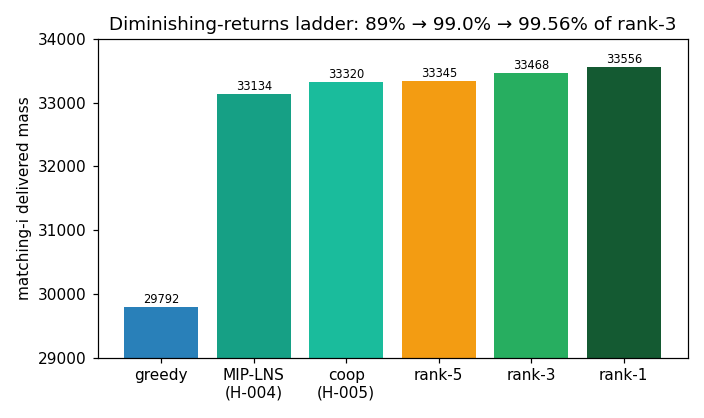

# T-003 — Diminishing-returns ladder; rank-3 needs exact-polish / commercial solver

## Summary

A clean halving ladder on `matching-i`: greedy **29 792 (89 %)** →
independent MIP-LNS **33 134 (99.0 %)** → cooperative+adaptive
**33 320 (99.56 %)**. Each mechanism upgrade closes ~half the
remaining gap to rank-3 (33 467.83) but asymptotes; per-worker
convergence is identical (33 318–33 320), so it is a true ceiling
of metaheuristic search, not a budget limit. The last **0.44 %
(~148 mass)** is the regime the top field occupies (rank-3 DIAG
33 468; rank-1 fcmaes 33 556) — almost certainly reached with a
strong **commercial exact solver** or a long exact polish, not
pure heuristics.

## Evidence

- [[hypotheses/H-005-ch1-matching-coop-mip-lns|H-005]] (refuted),
  [[experiments/E-003-ch1-matching-i-coop-mip-lns|E-003]],
  [[experiments/E-002-ch1-matching-i-mip-lns-campaign|E-002]],
  [[observations/O-002-leaderboard-2026-05-18|O-002]].

## Implications

1. **Stop scaling metaheuristic mechanisms** for the last 0.44 % —
   diminishing returns are explicit. Two real levers remain:
   (a) **exact polish**: warm-start a strong incumbent into large
   exact sub-MIPs / a long tuned full solve
   ([[hypotheses/H-006-ch1-matching-exact-polish|H-006]], running);
   (b) **commercial solver (Gurobi)** — the single highest-leverage
   unknown; `environment.yml` lists `gurobipy` as optional/licensed.
   **Escalated to user** (licence availability is decisive and not
   in the vault).
2. Conservative posture vindicated ([[user]]): a 99.56 % plateau
   ~0.44 % from the cutoff is exactly "hard, many local minima".
3. `matching-ii` (92 k) will behave the same — defer until the
   `matching-i` last-mile mechanism is settled.

## Position vs goal

- **Contribution:** `matching-i` artifact = 33 320, feasible ≈
  rank-6 → **scores ~5 easy pts** (steady climb: 0 → ~4 → ~5).
- **Where we stand:** 0.44 % from `matching-i` rank-3; nothing on
  `matching-ii`/Ch2/trajectory yet; H-006 polish in flight.
- **Next move:** H-006 result + the Gurobi decision; if both fall
  short, rank-3 on this instance may be infeasible without a
  commercial solver and the frontier should pivot (H-002 trajectory,
  ROI 1.2, Team-HRI-proved rank-3 reachable by greedy).

## Caveats

`matching-ii` unrun. Refutation is of cooperative-heuristic reaching
rank-3, not of exact-polish/Gurobi (open in H-006 / escalation).
