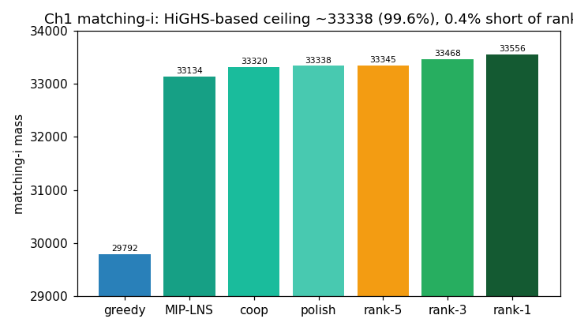

# T-004 — Ch1 matching HiGHS ceiling reached; pivot to trajectory

## Summary

Four method generations on `matching-i` —
greedy 29 792 → MIP-LNS 33 134 → coop 33 320 → exact-polish
33 338 — describe an asymptote at **~33 340 (99.6 % of rank-3)**.
The increments (3 342 → 186 → 18) are a textbook flattening: the
open-source-HiGHS family cannot reach the rank-3 cutoff (33 468)
on this instance. The user confirmed **no commercial solver** is
available; competitors at 33 468–33 556 almost certainly use one.

## Evidence

- [[hypotheses/H-006-ch1-matching-exact-polish|H-006]] (refuted),
  [[experiments/E-004-ch1-matching-i-exact-polish|E-004]],
  [[takeaways/T-003-diminishing-returns-need-exact-polish|T-003]],
  [[observations/O-002-leaderboard-2026-05-18|O-002]].

## Implications (decision record)

1. **Ch1-matching rank-3 is infeasible for us** (open-source only).
   Banked: `matching-i` = 33 338 ≈ leaderboard rank-6 → **~5 easy
   pts**; `matching-ii` campaign running (expect ~rank-6 similarly,
   more points). Valid feasible artifacts — real, non-zero standing.
2. **Pivot the frontier to [[hypotheses/H-002-ch1-trajectory-greedy|H-002]]**
   (user-approved). Rationale: ROI 1.2 with rank-3 *demonstrably
   reachable by a greedy* (Team HRI's R3 sub, O-002); ×(4/3)² weight;
   the user's physics strength (BCP). Higher expected return than
   chasing an infeasible 0.4 % on Ch1 matching.
3. Stop-rule learned: when a method family shows a clean halving
   asymptote ≥2 generations short of the goal, *pivot*, don't tune.

## Position vs goal

- **Contribution:** Ch1 matching ≈ 5 pts banked (matching-i) + more
  pending (matching-ii); 0 → ~5+ over the session.
- **Where we stand:** Ch1 matching closed at our ceiling; Ch1
  trajectory + all Ch2 still open and higher-leverage.
- **Next move:** finish `matching-ii` bank, then open H-002
  (Ch1 trajectory greedy) as the active branch.

## Caveats

If a commercial/academic Gurobi licence later appears, revisit
(matching-i/ii are pure ILPs a good MIP solver may close to
optimum) — would supersede this takeaway.
